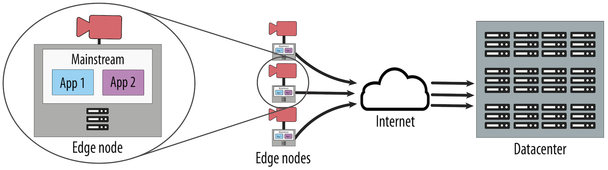

# Deployment

# Datasets

TODO: Markdown Table.

# Hardware

TODO: Intel NUC. Pictures of our camera setup.

# Real-life deployments at CMU in Pittsburgh

TODO: Deployment visualization (Fig 10).

TODO: Vimeo/YouTube video of deployment.

TODO: Description of III and train deployments.
