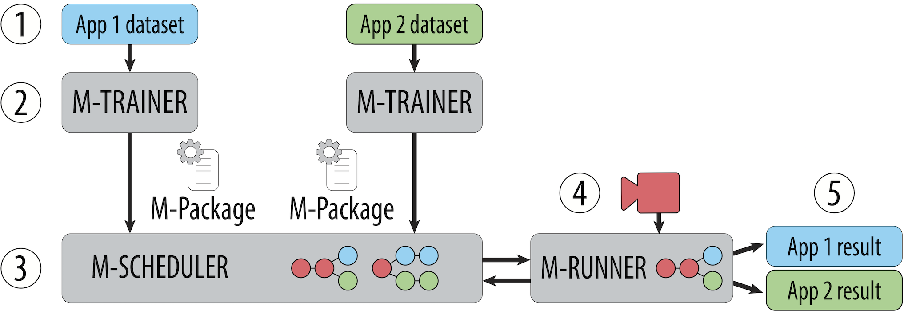

# What is Mainstream?

Mainstream is a video analysis system that jointly adapts concurrent
applications sharing fixed edge resources to maximize aggregate application
result quality.

# Why Mainstream?

Many practitioners use _transfer learning_ and fine-tune a pre-trained model for
their dataset instead of training their DNN (deep neural network) from scratch.
Since the same few common pre-trained models are used, we can share computation
between concurrent applications that operate on the same video stream.

Since the decision of how much to share is dependent on the co-located
applications and the hardware of the edge device, it is important that the
scheduling decision be made at deployment time rather than by the application
developer at training time. Mainstream does this automatically to get the best
aggregate performance across applications.

<!-- 

# How is this useful to me?

**Infrastructure Designer / Government.**
Design a platform around a single edge hardware node (e.g., an Intel NUC with
one GPU) located with the camera. Adopt Mainstream and support tens of real-time
video analysis applications instead of just one, and know that your platform
will continue to degrade gracefully even as newer applications are deployed onto
your existing hardware.

- [Find out more about deploying Mainstream!](deployment.md)

**Mobile Platform Designer.**
Adopt Mainstream to allow your models running off your video stream to be
tailored according to which models (e.g., AR plugins or apps) are selected by
the user, as well as the computational budget available (e.g., limited by
hardware, or by target energy consumption).

- [Find out more about deploying Mainstream!](deployment.md)

**Application Developer.**
Know that you can save on (average) inference cost at the edge by using a pre-
trained DNN (e.g., MobileNets, InceptionV3, VGG) and sharing that computation
with other simultaneously running applications. Given a choice between freezing
and fine-tuning layers for the same accuracy, you want to go with freezing.
With Mainstream, you do not have to share your training data with the platform
provider to get the benefits of computation sharing. Petition your
infrastructure provider to adopt Mainstream.

-->

# Architecture

**M-Trainer** takes a labeled dataset and outputs an *M-Package*.
**M-Scheduler** takes independently generated M-Packages, and chooses the
task-specific degree of specialization and frame rate. M-Scheduler deploys the
unified multi-task model to **M-Runner**, performing inference on the edge.

# Team

<!-- TODO: Columns (with bootstrap?) -->

## CMU Faculty
- Greg Ganger
- Dave Andersen

<!-- Second column -->
## Intel Research Pittsburgh
- Michael Kaminsky
- Michael A. Kozuch
- Padmanabhan Pillai

## PhD Students
- Angela Jiang
- Daniel Wong
- Christopher Canel

<!-- Second column -->
## Undergraduate Students
- Lilia Tang (Spring 2018, Summer 2018)
- Sidharth Verma (Spring 2018)

## CMU students and academics: join us!

If you're at CMU, we would love for you to work with us!

Systems for ML. Scheduling. Multi-Tenant Video Processing -- at the edge. Distributed systems.
Fairness. If this strikes a chord with you, let us know!

For students, whether you're an undergraduate or graduate student, looking for an independent study project,
a MCDS project, a capstone project, a class project, or a summer research
attachment, feel free to link up with us.

<!-- TODO: List of project ideas. -->

# Contact Us

If you have feedback or am interested in collaborating, feel free to reach out
to us.

- [Angela Jiang](https://www.cs.cmu.edu/directory/ahjiang)
- [Daniel Wong](http://www.cs.cmu.edu/~dlwong)

# Publications

**Mainstream: Dynamic Stem-Sharing for Multi-Tenant Video Processing**. 
Angela H. Jiang, Daniel Lin-Kit Wong, Christopher Canel, Lilia Tang, Ishan Misra, Michael Kaminsky, Michael A. Kozuch, Padmanabhan Pillai, David G. Andersen, Gregory R. Ganger 
_USENIX ATC_ 2018.
[[PDF]](https://www.usenix.org/system/files/conference/atc18/atc18-jiang.pdf) [[BibTeX]](https://www.usenix.org/biblio/export/bibtex/215993)

<!-- TODO: BibTeX Show/Hide JS -->

**Dynamic Stem-Sharing for Multi-Tenant Video Processing**. 
Angela Jiang, Christopher Canel, Daniel Lin-Kit Wong, Michael Kaminsky, Michael A. Kozuch, Padmanabhan Pillai, David G. Andersen, Gregory R. Ganger 
_SysML Conference_ 2018.
[[PDF]](http://www.sysml.cc/doc/149.pdf)

## Acknowledgments

We thank the member companies of the PDL Consortium (Alibaba, Broadcom, Dell EMC, Facebook, Google, HPE, Hitachi, IBM Research, Intel, Microsoft, MongoDB, NetApp, Oracle, Salesforce, Samsung, Seagate, Toshiba, Two Sigma, Veritas and Western Digital) for their interest, insights, feedback, and support. This work is supported in part by funding from Intel as part of the Intel STC for Visual Cloud Systems (ISTC-VCS).
